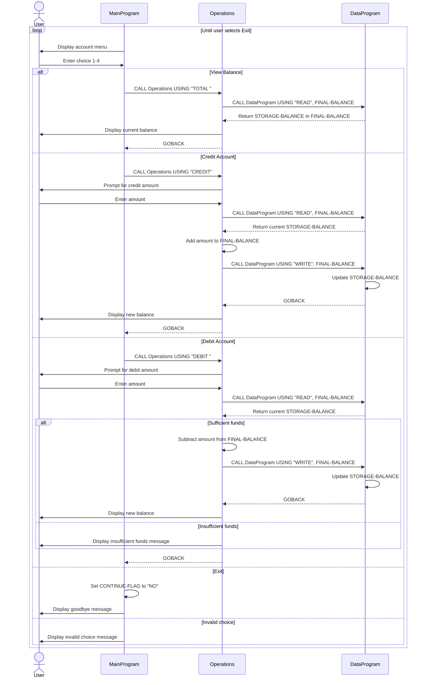

# COBOL Student Account Documentation

## Overview

This COBOL sample implements a simple student account management flow across three programs:

- `main.cob` presents the menu and routes the user's selection.
- `operations.cob` applies account operations such as viewing, crediting, and debiting.
- `data.cob` acts as a minimal persistence layer for the current account balance.

The programs communicate through fixed-width operation codes and shared numeric fields passed in the `USING` clause.

## File Purposes

### `src/cobol/main.cob`

**Program ID:** `MainProgram`

**Purpose:**
Runs the command-line interface for the student account system. It loops until the user chooses to exit and dispatches each menu action to the `Operations` program.

**Key logic:**

- Displays the account menu.
- Accepts a user choice from `1` to `4`.
- Calls `Operations` with one of these operation codes:
  - `TOTAL` plus one trailing space to display the current balance
  - `CREDIT` to add funds to the account
  - `DEBIT` plus one trailing space to remove funds from the account
- Ends the session when the user selects option `4`.
- Rejects invalid menu selections with an error message.

### `src/cobol/operations.cob`

**Program ID:** `Operations`

**Purpose:**
Implements the account business operations. This program interprets the operation code received from `MainProgram`, reads the current balance from `DataProgram`, applies the requested business rule, and writes the updated balance back when needed.

**Key logic:**

- Receives a 6-character operation code in `PASSED-OPERATION`.
- For `TOTAL` plus one trailing space:
  - Reads the current balance from `DataProgram`.
  - Displays the balance.
- For `CREDIT`:
  - Prompts for an amount.
  - Reads the current balance.
  - Adds the amount to the balance.
  - Writes the new balance back through `DataProgram`.
  - Displays the updated balance.
- For `DEBIT` plus one trailing space:
  - Prompts for an amount.
  - Reads the current balance.
  - Subtracts the amount only when sufficient funds are available.
  - Writes the updated balance back through `DataProgram`.
  - Displays either the new balance or an insufficient funds message.

### `src/cobol/data.cob`

**Program ID:** `DataProgram`

**Purpose:**
Provides a minimal storage abstraction for the account balance. It supports a read operation that returns the current stored value and a write operation that replaces it.

**Key logic:**

- Maintains `STORAGE-BALANCE` in working storage.
- Accepts these operation codes:
  - `READ` to copy `STORAGE-BALANCE` into the linked `BALANCE` field
  - `WRITE` to copy the linked `BALANCE` field into `STORAGE-BALANCE`
- Returns control to the caller with `GOBACK`.

## Call Flow

1. `MainProgram` displays the menu and accepts a choice.
2. `MainProgram` calls `Operations` with a fixed-length operation code.
3. `Operations` calls `DataProgram` with either `READ` or `WRITE`.
4. `DataProgram` returns the current balance or stores the updated balance.
5. `Operations` displays the result to the user and returns to `MainProgram`.

## Student Account Business Rules

The current implementation enforces these rules:

- The student account starts with a default balance of `1000.00`.
- A balance inquiry does not modify the account.
- A credit increases the balance by the entered amount.
- A debit decreases the balance only when the current balance is greater than or equal to the requested amount.
- Debits that exceed the available balance are rejected with `Insufficient funds for this debit.`
- The application handles one account balance in memory; there is no student identifier, account lookup, or persistent file/database storage.

## Integration Notes

- Operation codes are fixed-width strings, so trailing spaces matter:
  - `TOTAL` and `DEBIT` are each padded with one trailing space to reach 6 characters.
  - `CREDIT` is already 6 characters.
  - `READ` and `WRITE` are used by `DataProgram`.
- Both `data.cob` and `operations.cob` initialize balance-related working-storage values to `1000.00`, but the authoritative stored value is the `STORAGE-BALANCE` field inside `DataProgram` after the first read/write cycle.
- There is no validation preventing negative or zero amounts from being entered.

## Suggested Modernization Targets

If this code is extended, the highest-value improvements would be:

- add input validation for amounts
- separate student identity from balance storage
- replace in-memory storage with file or database persistence
- centralize business rules so menu handling and account rules stay decoupled

## Sequence Diagram

